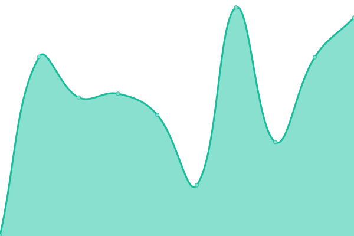

# [📈 Live Status](https://whosawhosa.github.io/upptime): <!--live status--> **🟩 All systems operational**

This repository contains the open-source uptime monitor and status page for [whosawhosa](https://whosawhosa.github.io/upptime), powered by [Upptime](https://github.com/upptime/upptime).

With [Upptime](https://upptime.js.org), you can get your own unlimited and free uptime monitor and status page, powered entirely by a GitHub repository. We use [Issues](https://github.com/whosawhosa/upptime/issues) as incident reports, [Actions](https://github.com/whosawhosa/upptime/actions) as uptime monitors, and [Pages](https://whosawhosa.github.io/upptime) for the status page.

<!--start: status pages-->
<!-- This summary is generated by Upptime (https://github.com/upptime/upptime) -->
<!-- Do not edit this manually, your changes will be overwritten -->
<!-- prettier-ignore -->
| URL | Status | History | Response Time | Uptime |
| --- | ------ | ------- | ------------- | ------ |
|  [Google](https://www.google.com) | 🟩 Up | [google.yml](https://github.com/whosawhosa/upptime/commits/HEAD/history/google.yml) | 

 81ms
     
 | 

<a href="https://status.drekay.com/history/google">100.00%</a>
    

|  [Wikipedia](https://en.wikipedia.org) | 🟩 Up | [wikipedia.yml](https://github.com/whosawhosa/upptime/commits/HEAD/history/wikipedia.yml) | 

 222ms
     
 | 

<a href="https://status.drekay.com/history/wikipedia">100.00%</a>
    

|  [Facebook](https://www.facebook.com) | 🟩 Up | [facebook.yml](https://github.com/whosawhosa/upptime/commits/HEAD/history/facebook.yml) | 

 253ms
     
 | 

<a href="https://status.drekay.com/history/facebook">100.00%</a>
    

|  [Apple](https://www.apple.com) | 🟩 Up | [apple.yml](https://github.com/whosawhosa/upptime/commits/HEAD/history/apple.yml) | 

 253ms
     
 | 

<a href="https://status.drekay.com/history/apple">100.00%</a>
    

|  [www.twitter.com](https://www.twitter.com) | 🟩 Up | [www-twitter-com.yml](https://github.com/whosawhosa/upptime/commits/HEAD/history/www-twitter-com.yml) | 

 316ms
     
 | 

<a href="https://status.drekay.com/history/www-twitter-com">100.00%</a>
    

|  [TESLA](https://www.tesla.com) | 🟩 Up | [tesla.yml](https://github.com/whosawhosa/upptime/commits/HEAD/history/tesla.yml) | 

 608ms
     
 | 

<a href="https://status.drekay.com/history/tesla">100.00%</a>
    

|  [Github](https://www.github.com) | 🟩 Up | [github.yml](https://github.com/whosawhosa/upptime/commits/HEAD/history/github.yml) | 

 454ms
     
 | 

<a href="https://status.drekay.com/history/github">100.00%</a>
    

<!--end: status pages-->

[**Visit our status website →**](https://whosawhosa.github.io/upptime)

## 📄 License

- Powered by: [Upptime](https://github.com/upptime/upptime)
- Code: [MIT](./LICENSE) © [whosawhosa](https://whosawhosa.github.io/upptime)
- Data in the `./history` directory: [Open Database License](https://opendatacommons.org/licenses/odbl/1-0/)
