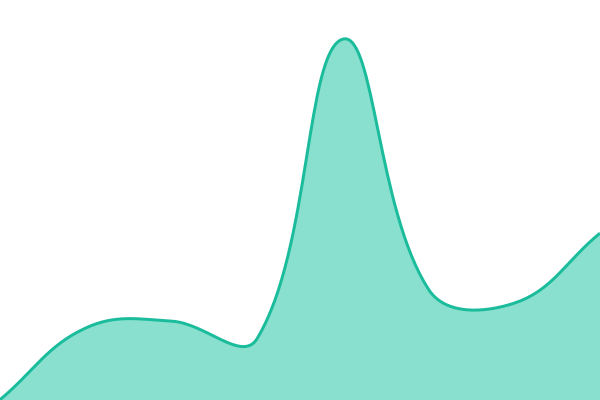
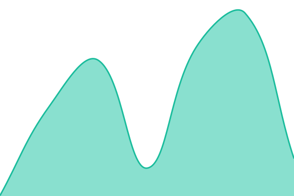

# [📈 Live Status](https://whosawhosa.github.io/upptime): <!--live status--> **🟩 All systems operational**

This repository contains the open-source uptime monitor and status page for [whosawhosa](https://whosawhosa.github.io/upptime), powered by [Upptime](https://github.com/upptime/upptime).

With [Upptime](https://upptime.js.org), you can get your own unlimited and free uptime monitor and status page, powered entirely by a GitHub repository. We use [Issues](https://github.com/whosawhosa/upptime/issues) as incident reports, [Actions](https://github.com/whosawhosa/upptime/actions) as uptime monitors, and [Pages](https://whosawhosa.github.io/upptime) for the status page.

<!--start: status pages-->
<!-- This summary is generated by Upptime (https://github.com/upptime/upptime) -->
<!-- Do not edit this manually, your changes will be overwritten -->
<!-- prettier-ignore -->
| URL | Status | History | Response Time | Uptime |
| --- | ------ | ------- | ------------- | ------ |
|  [AppleDaily台灣蘋果日報](https://tw.appledaily.com) | 🟩 Up | [apple-daily.yml](https://github.com/whosawhosa/upptime/commits/HEAD/history/apple-daily.yml) | 

 1173ms
     
 | 

<a href="https://news.drekay.com/history/apple-daily">100.00%</a>
    

|  [ET-Today新聞雲](https://www.ettoday.net/) | 🟩 Up | [et-today.yml](https://github.com/whosawhosa/upptime/commits/HEAD/history/et-today.yml) | 

 2088ms
     
 | 

<a href="https://news.drekay.com/history/et-today">100.00%</a>
    

|  [SETN三立新聞](https://www.setn.com/) | 🟩 Up | [setn.yml](https://github.com/whosawhosa/upptime/commits/HEAD/history/setn.yml) | 

 409ms
     
 | 

<a href="https://news.drekay.com/history/setn">98.88%</a>
    

|  [CHINATIMES中時新聞網](https://www.chinatimes.com/?chdtv) | 🟩 Up | [chinatimes.yml](https://github.com/whosawhosa/upptime/commits/HEAD/history/chinatimes.yml) | 

 271ms
     
 | 

<a href="https://news.drekay.com/history/chinatimes">100.00%</a>
    

|  [TVBS新聞網](https://www.tvbs.com.tw/) | 🟩 Up | [tvbs.yml](https://github.com/whosawhosa/upptime/commits/HEAD/history/tvbs.yml) | 

 824ms
     
 | 

<a href="https://news.drekay.com/history/tvbs">100.00%</a>
    

|  [MirrorMedia鏡週刊](https://www.mirrormedia.mg/) | 🟩 Up | [mirror-media.yml](https://github.com/whosawhosa/upptime/commits/HEAD/history/mirror-media.yml) | 

 2227ms
     
 | 

<a href="https://news.drekay.com/history/mirror-media">100.00%</a>
    

|  [UDN聯合新聞網](https://udn.com/news/index) | 🟩 Up | [udn.yml](https://github.com/whosawhosa/upptime/commits/HEAD/history/udn.yml) | 

 308ms
     
 | 

<a href="https://news.drekay.com/history/udn">100.00%</a>
    

|  [Yahoo奇摩新聞](https://tw.news.yahoo.com/) | 🟩 Up | [yahoo.yml](https://github.com/whosawhosa/upptime/commits/HEAD/history/yahoo.yml) | 

 697ms
     
 | 

<a href="https://news.drekay.com/history/yahoo">100.00%</a>
    

|  [LTN自由時報電子報](https://www.ltn.com.tw/) | 🟩 Up | [ltn.yml](https://github.com/whosawhosa/upptime/commits/HEAD/history/ltn.yml) | 

 1260ms
     
 | 

<a href="https://news.drekay.com/history/ltn">100.00%</a>
    

|  [NOWnews今日新聞](https://www.nownews.com/) | 🟩 Up | [no-wnews.yml](https://github.com/whosawhosa/upptime/commits/HEAD/history/no-wnews.yml) | 

 2616ms
     
 | 

<a href="https://news.drekay.com/history/no-wnews">100.00%</a>
    

|  [newtalk新頭殼](https://newtalk.tw/) | 🟩 Up | [newtalk.yml](https://github.com/whosawhosa/upptime/commits/HEAD/history/newtalk.yml) | 

 502ms
     
 | 

<a href="https://news.drekay.com/history/newtalk">100.00%</a>
    

|  [TechNews 科技新報](https://technews.tw/) | 🟩 Up | [tech-news.yml](https://github.com/whosawhosa/upptime/commits/HEAD/history/tech-news.yml) | 

 774ms
     
 | 

<a href="https://news.drekay.com/history/tech-news">100.00%</a>
    

|  [businessweekly商業週刊](https://www.businessweekly.com.tw/) | 🟩 Up | [businessweekly.yml](https://github.com/whosawhosa/upptime/commits/HEAD/history/businessweekly.yml) | 

 3886ms
     
 | 

<a href="https://news.drekay.com/history/businessweekly">100.00%</a>
    

<!--end: status pages-->

[**Visit our status website →**](https://whosawhosa.github.io/upptime)

## 📄 License

- Powered by: [Upptime](https://github.com/upptime/upptime)
- Code: [MIT](./LICENSE) © [whosawhosa](https://whosawhosa.github.io/upptime)
- Data in the `./history` directory: [Open Database License](https://opendatacommons.org/licenses/odbl/1-0/)
